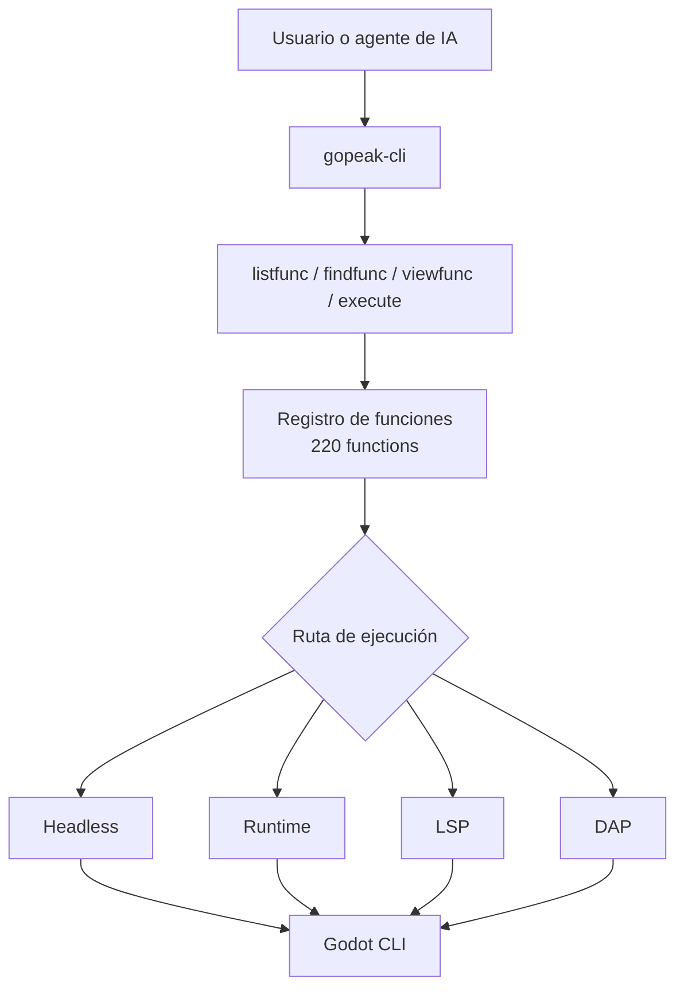

# GoPeak CLI

<p align="center">
  
</p>

[English](README.md) | [한국어](README.ko.md) | [Español](README.es.md) | [Português](README.pt-BR.md) | [Italiano](README.it.md)

[](https://www.npmjs.com/package/gopeak-cli)
[](LICENSE)
[](https://godotengine.org)
[](https://www.typescriptlang.org/)
[](https://discord.gg/FPKn4Xp8)

**GoPeak CLI es una CLI compacta de automatización para Godot y también un servidor MCP para humanos y agentes de IA.**

> Únete a la comunidad de GoPeak en Discord: https://discord.gg/FPKn4Xp8

Expone **220 funciones de Godot** mediante **4 meta-herramientas MCP** en lugar de cientos de herramientas individuales.
Eso significa:

- menos desperdicio de contexto
- descubrimiento de funciones más rápido
- prompts más simples
- mejor escalabilidad a medida que crecen las funciones

---

## Por qué esta arquitectura CLI es potente

Los servidores MCP tradicionales para Godot suelen registrar una herramienta por cada capacidad.
Eso se vuelve ruidoso, pesado y costoso para los clientes de IA.

GoPeak CLI usa un patrón mejor:

- **4 meta-herramientas estables** para descubrir y ejecutar
- **220 funciones guardadas en un registro**
- **enrutamiento por motor de ejecución** en vez de una herramienta por función
- **CLI y MCP compartiendo el mismo núcleo**

### Resultado

- los agentes de IA descubren funciones solo cuando las necesitan
- añadir funciones nuevas **no** infla la lista de herramientas MCP
- los usuarios de terminal obtienen el mismo poder sin depender de un cliente MCP

---

## Cómo funciona



### Modelo mental

1. **Descubrir** lo que existe
2. **Inspeccionar** el esquema de la función
3. **Ejecutar** la función con el motor correcto

---

## Herramientas MCP principales

Estas son las únicas herramientas MCP expuestas al cliente:

- **`Godot.listfunc`** — listar funciones disponibles
- **`Godot.findfunc`** — buscar funciones por patrón
- **`Godot.viewfunc`** — inspeccionar definición y esquema
- **`Godot.execute`** — ejecutar una función con argumentos validados

Esta es la razón principal por la que el sistema sigue siendo compacto incluso con 220 operaciones.

---

## Requisitos

- **Node.js 18+**
- **Godot 4.x**
- Opcional: un cliente compatible con MCP como Claude Desktop, Cursor, Cline, Codex u OpenCode

---

## Instalación

### Ejecutar sin instalación global

```bash
npx gopeak-cli listfunc --format text
```

### Instalación global

```bash
npm install -g gopeak-cli
```

### Compilar desde el código fuente

```bash
git clone https://github.com/HaD0Yun/Gopeak-Godot-Cli.git
cd Gopeak-Godot-Cli
npm install
npm run build
```

---

## Inicio rápido

```bash
gopeak-cli doctor --format text
gopeak-cli listfunc --format text
gopeak-cli findfunc scene --format text
gopeak-cli viewfunc create_scene --format text
gopeak-cli exec create_scene --args '{"scene_name":"Player","root_type":"CharacterBody2D"}' --format text
```

---

## Comandos CLI

```text
doctor
config
listfunc
findfunc
viewfunc
exec
daemon
setup
check
notify
star
uninstall
version
install-skill
```

### Comandos más útiles

```bash
gopeak-cli doctor --format text
gopeak-cli listfunc --category scene --format text
gopeak-cli findfunc breakpoint --format text
gopeak-cli viewfunc run_project --format text
gopeak-cli exec run_project --format text
gopeak-cli exec lsp_diagnostics --args '{"filePath":"res://scripts/player.gd"}' --format text
```

---

## Configuración de wrappers para AI CLI

GoPeak CLI puede instalar hooks de shell para comprobar actualizaciones y mostrar prompts opcionales para dar estrella en GitHub.

### Comportamiento por defecto

```bash
gopeak-cli setup
```

Esto instala un bloque de shell hook **pasivo**.
No envuelve directamente CLIs de terceros.

### Activar wrapping para AI CLI

```bash
gopeak-cli setup --wrap-ai-clis
source ~/.bashrc
```

Cuando está activado, puede envolver comandos como:

- `claude`
- `claudecode`
- `codex`
- `cursor`
- `gemini`
- `copilot`
- `omc`
- `opencode`
- `omx`

Comandos relacionados:

```bash
gopeak-cli check
gopeak-cli notify
gopeak-cli star
gopeak-cli uninstall
```

---

## Ejemplo de configuración MCP

```json
{
  "mcpServers": {
    "gopeak-cli": {
      "command": "gopeak-cli",
      "args": [],
      "env": {
        "GODOT_FLOW_PROJECT_PATH": "/path/to/your/project",
        "GODOT_FLOW_GODOT_PATH": "/path/to/godot"
      }
    }
  }
}
```

### Modo NPX

```json
{
  "mcpServers": {
    "gopeak-cli": {
      "command": "npx",
      "args": ["-y", "gopeak-cli"],
      "env": {
        "GODOT_FLOW_PROJECT_PATH": "/path/to/your/project"
      }
    }
  }
}
```

---

## Motores de ejecución

GoPeak CLI enruta funciones a través de cuatro backends:

- **Headless** — ejecución puntual mediante Godot CLI
- **Runtime** — comunicación con un juego en ejecución
- **LSP** — inspección y análisis de código
- **DAP** — flujos de depuración

---

## Por qué un enfoque terminal-first importa

Una buena CLI te da:

- automatización por scripts
- depuración más fácil
- flujos reproducibles
- una única superficie de ejecución compartida por usuarios y agentes de IA

En resumen, GoPeak CLI no es solo un wrapper de MCP. También es una superficie de automatización fuerte por sí sola.

---

## Verificación

Comandos útiles para validar la instalación:

```bash
gopeak-cli doctor --format text
npm run typecheck
npm run build
npm test
```

---

## Licencia

MIT
