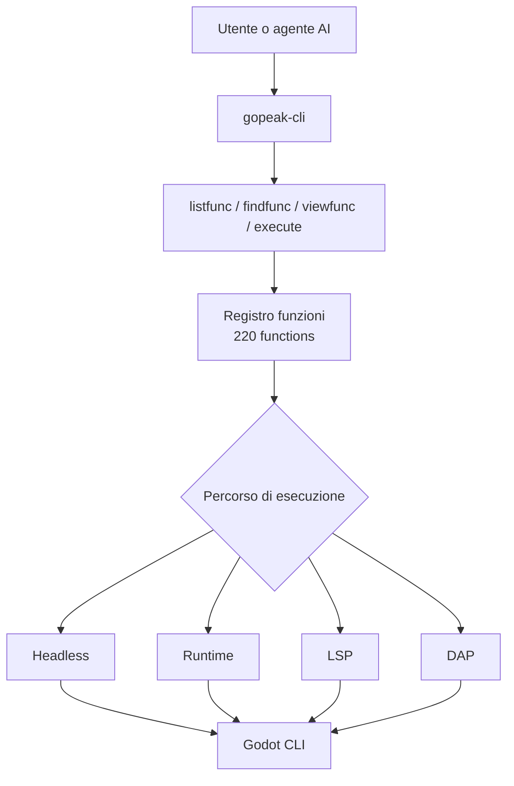

# GoPeak CLI

<p align="center">
  
</p>

[English](README.md) | [한국어](README.ko.md) | [Español](README.es.md) | [Português](README.pt-BR.md) | [Italiano](README.it.md)

[](https://www.npmjs.com/package/gopeak-cli)
[](LICENSE)
[](https://godotengine.org)
[](https://www.typescriptlang.org/)
[](https://discord.gg/FPKn4Xp8)

**GoPeak CLI è una CLI compatta per l'automazione di Godot ed è anche un server MCP per esseri umani e agenti AI.**

> Unisciti alla community Discord di GoPeak: https://discord.gg/FPKn4Xp8

Espone **220 funzioni Godot** tramite **4 meta-tool MCP** invece di centinaia di tool separati.
Questo significa:

- meno spreco di contesto
- scoperta delle funzioni più veloce
- prompt più semplici
- migliore scalabilità quando le funzioni aumentano

---

## Perché questa architettura CLI è potente

I server MCP tradizionali per Godot spesso registrano un tool per ogni capacità.
Questo rende tutto più rumoroso, pesante e costoso per i client AI.

GoPeak CLI usa un approccio migliore:

- **4 meta-tool stabili** per discovery + execution
- **220 funzioni archiviate in un registro**
- **instradamento per motore di esecuzione** invece di un tool per funzione
- **CLI e MCP condividono lo stesso core**

### Risultato

- gli agenti AI scoprono le funzioni solo quando servono
- aggiungere nuove funzioni **non** gonfia la lista dei tool MCP
- gli utenti terminal ottengono la stessa potenza senza dipendere da un client MCP

---

## Come funziona



### Modello mentale

1. **Scopri** cosa esiste
2. **Ispeziona** lo schema della funzione
3. **Esegui** la funzione con il motore corretto

---

## Tool MCP principali

Questi sono gli unici tool MCP esposti ai client:

- **`Godot.listfunc`** — elenca le funzioni disponibili
- **`Godot.findfunc`** — cerca funzioni per pattern
- **`Godot.viewfunc`** — ispeziona definizione e schema
- **`Godot.execute`** — esegue una funzione con argomenti validati

Questo è il motivo principale per cui il sistema resta compatto pur supportando 220 operazioni.

---

## Requisiti

- **Node.js 18+**
- **Godot 4.x**
- Opzionale: un client compatibile MCP come Claude Desktop, Cursor, Cline, Codex o OpenCode

---

## Installazione

### Esegui senza installazione globale

```bash
npx gopeak-cli listfunc --format text
```

### Installazione globale

```bash
npm install -g gopeak-cli
```

### Build dal sorgente

```bash
git clone https://github.com/HaD0Yun/Gopeak-Godot-Cli.git
cd Gopeak-Godot-Cli
npm install
npm run build
```

---

## Avvio rapido

```bash
gopeak-cli doctor --format text
gopeak-cli listfunc --format text
gopeak-cli findfunc scene --format text
gopeak-cli viewfunc create_scene --format text
gopeak-cli exec create_scene --args '{"scene_name":"Player","root_type":"CharacterBody2D"}' --format text
```

---

## Comandi CLI

```text
doctor
config
listfunc
findfunc
viewfunc
exec
daemon
setup
check
notify
star
uninstall
version
install-skill
```

### Comandi più utili

```bash
gopeak-cli doctor --format text
gopeak-cli listfunc --category scene --format text
gopeak-cli findfunc breakpoint --format text
gopeak-cli viewfunc run_project --format text
gopeak-cli exec run_project --format text
gopeak-cli exec lsp_diagnostics --args '{"filePath":"res://scripts/player.gd"}' --format text
```

---

## Setup dei wrapper per AI CLI

GoPeak CLI può installare shell hook per il controllo aggiornamenti e prompt opzionali per mettere la stella su GitHub.

### Comportamento predefinito

```bash
gopeak-cli setup
```

Questo installa un blocco di shell hook **passivo**.
Non avvolge direttamente CLI di terze parti.

### Abilitare il wrapping per AI CLI

```bash
gopeak-cli setup --wrap-ai-clis
source ~/.bashrc
```

Quando è attivo, GoPeak CLI può avvolgere comandi come:

- `claude`
- `claudecode`
- `codex`
- `cursor`
- `gemini`
- `copilot`
- `omc`
- `opencode`
- `omx`

Comandi correlati:

```bash
gopeak-cli check
gopeak-cli notify
gopeak-cli star
gopeak-cli uninstall
```

---

## Esempio di configurazione MCP

```json
{
  "mcpServers": {
    "gopeak-cli": {
      "command": "gopeak-cli",
      "args": [],
      "env": {
        "GODOT_FLOW_PROJECT_PATH": "/path/to/your/project",
        "GODOT_FLOW_GODOT_PATH": "/path/to/godot"
      }
    }
  }
}
```

### Modalità NPX

```json
{
  "mcpServers": {
    "gopeak-cli": {
      "command": "npx",
      "args": ["-y", "gopeak-cli"],
      "env": {
        "GODOT_FLOW_PROJECT_PATH": "/path/to/your/project"
      }
    }
  }
}
```

---

## Motori di esecuzione

GoPeak CLI instrada le funzioni attraverso quattro backend:

- **Headless** — esecuzione one-shot tramite Godot CLI
- **Runtime** — comunicazione con un gioco in esecuzione
- **LSP** — ispezione e analisi del codice
- **DAP** — workflow di debugging

---

## Perché il terminal-first conta

Una buona CLI offre:

- automazione via script
- debug più semplice
- workflow riproducibili
- una singola superficie di esecuzione condivisa tra utenti e agenti AI

In breve: GoPeak CLI non è solo un wrapper MCP. È anche una solida superficie di automazione di per sé.

---

## Verifica

Comandi utili per verificare la configurazione:

```bash
gopeak-cli doctor --format text
npm run typecheck
npm run build
npm test
```

---

## Licenza

MIT
