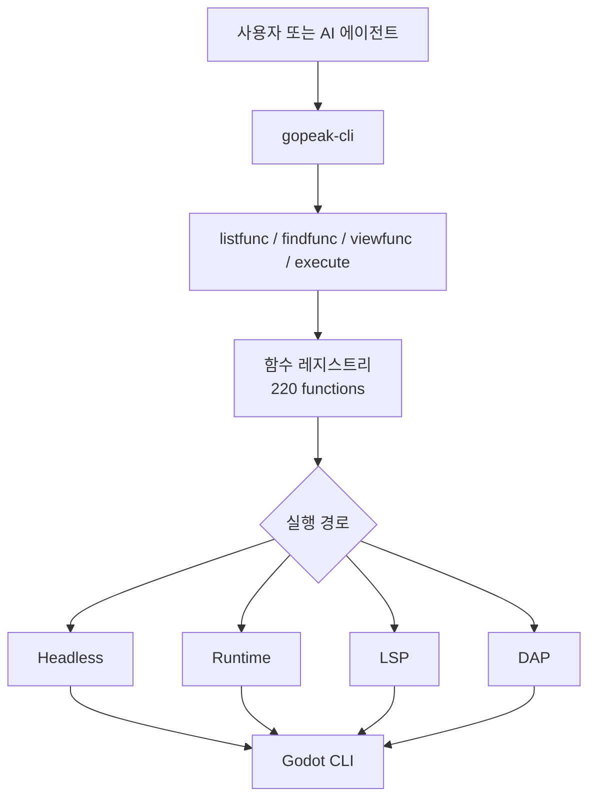

# GoPeak CLI

<p align="center">
  
</p>

[English](README.md) | [한국어](README.ko.md) | [Español](README.es.md) | [Português](README.pt-BR.md) | [Italiano](README.it.md)

[](https://www.npmjs.com/package/gopeak-cli)
[](LICENSE)
[](https://godotengine.org)
[](https://www.typescriptlang.org/)
[](https://discord.gg/FPKn4Xp8)

**GoPeak CLI는 사람과 AI 에이전트를 위한 가벼운 Godot 자동화 CLI이자 MCP 서버입니다.**

> GoPeak Discord 커뮤니티: https://discord.gg/FPKn4Xp8

이 프로젝트는 **220개의 Godot 함수**를 **4개의 MCP 메타 툴**로 노출합니다. 수백 개의 개별 툴을 한꺼번에 노출하지 않기 때문에 다음과 같은 장점이 있습니다.

- 컨텍스트 낭비 감소
- 더 빠른 기능 탐색
- 더 쉬운 프롬프팅
- 기능이 늘어나도 확장하기 쉬움

---

## 왜 이 CLI 구조가 강한가

전통적인 Godot MCP 서버는 기능 하나마다 툴 하나를 등록하는 경우가 많습니다.
그 방식은 AI 클라이언트 입장에서 시끄럽고 무겁고 비효율적입니다.

GoPeak CLI는 다른 방식을 사용합니다.

- **탐색 + 실행을 위한 4개의 안정적인 메타 툴**
- **220개 함수가 레지스트리에 저장됨**
- **one-tool-per-function 대신 실행 엔진 기반 라우팅**
- **CLI와 MCP가 같은 코어를 공유**

### 결과

- AI는 필요할 때만 함수를 찾습니다
- 함수가 늘어나도 MCP 툴 목록이 비대해지지 않습니다
- 터미널 사용자도 MCP 없이 같은 기능을 쓸 수 있습니다

---

## 동작 방식



### 이해하기 쉬운 흐름

1. **무엇이 있는지 찾기**
2. **함수 스키마 확인하기**
3. **적절한 엔진으로 실행하기**

---

## 핵심 MCP 툴

클라이언트에 노출되는 MCP 툴은 이 4개뿐입니다.

- **`Godot.listfunc`** — 사용 가능한 함수 목록 보기
- **`Godot.findfunc`** — 패턴으로 함수 검색
- **`Godot.viewfunc`** — 함수 정의와 스키마 확인
- **`Godot.execute`** — 인자를 검증한 뒤 함수 실행

이 구조 덕분에 220개 기능을 유지하면서도 인터페이스는 작게 유지됩니다.

---

## 요구 사항

- **Node.js 18+**
- **Godot 4.x**
- 선택 사항: Claude Desktop, Cursor, Cline, Codex, OpenCode 같은 MCP 클라이언트

---

## 설치

### 전역 설치 없이 실행

```bash
npx gopeak-cli listfunc --format text
```

### 전역 설치

```bash
npm install -g gopeak-cli
```

### 소스에서 빌드

```bash
git clone https://github.com/HaD0Yun/Gopeak-Godot-Cli.git
cd Gopeak-Godot-Cli
npm install
npm run build
```

---

## 빠른 시작

```bash
# 환경 확인
gopeak-cli doctor --format text

# 전체 함수 보기
gopeak-cli listfunc --format text

# 원하는 기능 검색
gopeak-cli findfunc scene --format text

# 함수 상세 확인
gopeak-cli viewfunc create_scene --format text

# 함수 실행
gopeak-cli exec create_scene --args '{"scene_name":"Player","root_type":"CharacterBody2D"}' --format text
```

---

## 주요 CLI 명령

```text
doctor
config
listfunc
findfunc
viewfunc
exec
daemon
setup
check
notify
star
uninstall
version
install-skill
```

### 자주 쓰는 예시

```bash
gopeak-cli doctor --format text
gopeak-cli listfunc --category scene --format text
gopeak-cli findfunc breakpoint --format text
gopeak-cli viewfunc run_project --format text
gopeak-cli exec run_project --format text
gopeak-cli exec lsp_diagnostics --args '{"filePath":"res://scripts/player.gd"}' --format text
```

---

## AI CLI wrapper 설정

GoPeak CLI는 업데이트 확인과 GitHub star 프롬프트를 위한 셸 훅을 설치할 수 있습니다.

### 기본 동작

```bash
gopeak-cli setup
```

이 명령은 **passive** 셸 훅 블록을 설치합니다.
다른 AI CLI를 직접 감싸지는 않습니다.

### AI CLI 래핑 활성화

```bash
gopeak-cli setup --wrap-ai-clis
source ~/.bashrc
```

활성화하면 다음과 같은 명령을 감쌀 수 있습니다.

- `claude`
- `claudecode`
- `codex`
- `cursor`
- `gemini`
- `copilot`
- `omc`
- `opencode`
- `omx`

관련 명령:

```bash
gopeak-cli check
gopeak-cli notify
gopeak-cli star
gopeak-cli uninstall
```

---

## MCP 설정 예시

```json
{
  "mcpServers": {
    "gopeak-cli": {
      "command": "gopeak-cli",
      "args": [],
      "env": {
        "GODOT_FLOW_PROJECT_PATH": "/path/to/your/project",
        "GODOT_FLOW_GODOT_PATH": "/path/to/godot"
      }
    }
  }
}
```

### NPX 모드

```json
{
  "mcpServers": {
    "gopeak-cli": {
      "command": "npx",
      "args": ["-y", "gopeak-cli"],
      "env": {
        "GODOT_FLOW_PROJECT_PATH": "/path/to/your/project"
      }
    }
  }
}
```

---

## 실행 엔진

GoPeak CLI는 함수를 4개의 백엔드로 라우팅합니다.

- **Headless** — Godot CLI를 이용한 one-shot 실행
- **Runtime** — 실행 중인 게임과 통신
- **LSP** — 코드 인텔리전스 / 분석
- **DAP** — 디버깅 워크플로우

이 구조 덕분에 상황에 맞는 자동화가 가능합니다.

---

## 왜 terminal-first가 중요한가

좋은 CLI는 다음을 제공합니다.

- 자동화 스크립팅
- 쉬운 디버깅
- 재현 가능한 워크플로우
- 터미널 사용자와 AI 에이전트가 공유하는 단일 실행면

즉 GoPeak CLI는 단순한 MCP 래퍼가 아니라, 그 자체로 강력한 자동화 인터페이스입니다.

---

## 검증

설치 상태를 점검할 때 유용한 명령:

```bash
gopeak-cli doctor --format text
npm run typecheck
npm run build
npm test
```

---

## 라이선스

MIT
