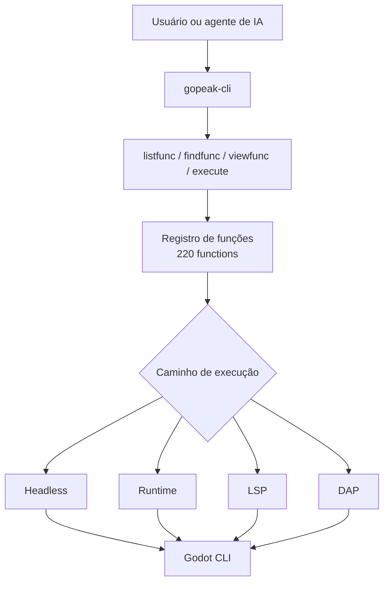

# GoPeak CLI

<p align="center">
  
</p>

[English](README.md) | [한국어](README.ko.md) | [Español](README.es.md) | [Português](README.pt-BR.md) | [Italiano](README.it.md)

[](https://www.npmjs.com/package/gopeak-cli)
[](LICENSE)
[](https://godotengine.org)
[](https://www.typescriptlang.org/)
[](https://discord.gg/FPKn4Xp8)

**GoPeak CLI é uma CLI compacta de automação para Godot e também um servidor MCP para pessoas e agentes de IA.**

> Entre na comunidade GoPeak no Discord: https://discord.gg/FPKn4Xp8

Ela expõe **220 funções do Godot** por meio de **4 meta-ferramentas MCP** em vez de centenas de ferramentas individuais.
Isso significa:

- menos desperdício de contexto
- descoberta de funções mais rápida
- prompts mais simples
- escalabilidade melhor conforme o número de funções cresce

---

## Por que essa arquitetura CLI é forte

Servidores MCP tradicionais para Godot costumam registrar uma ferramenta para cada capacidade.
Isso fica barulhento, pesado e caro para clientes de IA.

GoPeak CLI usa um padrão melhor:

- **4 meta-ferramentas estáveis** para descoberta + execução
- **220 funções armazenadas em um registro**
- **roteamento por engine de execução** em vez de uma ferramenta por função
- **CLI e MCP compartilhando o mesmo núcleo**

### Resultado

- agentes de IA descobrem funções apenas quando precisam
- adicionar novas funções **não** infla a lista de ferramentas MCP
- usuários de terminal têm o mesmo poder sem depender de um cliente MCP

---

## Como funciona



### Modelo mental

1. **Descobrir** o que existe
2. **Inspecionar** o schema da função
3. **Executar** a função pela engine correta

---

## Ferramentas MCP principais

Estas são as únicas ferramentas MCP expostas para o cliente:

- **`Godot.listfunc`** — listar funções disponíveis
- **`Godot.findfunc`** — buscar funções por padrão
- **`Godot.viewfunc`** — inspecionar definição e schema
- **`Godot.execute`** — executar uma função com argumentos validados

É isso que mantém o sistema compacto mesmo com 220 operações.

---

## Requisitos

- **Node.js 18+**
- **Godot 4.x**
- Opcional: um cliente compatível com MCP como Claude Desktop, Cursor, Cline, Codex ou OpenCode

---

## Instalação

### Executar sem instalação global

```bash
npx gopeak-cli listfunc --format text
```

### Instalação global

```bash
npm install -g gopeak-cli
```

### Compilar a partir do código-fonte

```bash
git clone https://github.com/HaD0Yun/Gopeak-Godot-Cli.git
cd Gopeak-Godot-Cli
npm install
npm run build
```

---

## Início rápido

```bash
gopeak-cli doctor --format text
gopeak-cli listfunc --format text
gopeak-cli findfunc scene --format text
gopeak-cli viewfunc create_scene --format text
gopeak-cli exec create_scene --args '{"scene_name":"Player","root_type":"CharacterBody2D"}' --format text
```

---

## Comandos CLI

```text
doctor
config
listfunc
findfunc
viewfunc
exec
daemon
setup
check
notify
star
uninstall
version
install-skill
```

### Comandos mais úteis

```bash
gopeak-cli doctor --format text
gopeak-cli listfunc --category scene --format text
gopeak-cli findfunc breakpoint --format text
gopeak-cli viewfunc run_project --format text
gopeak-cli exec run_project --format text
gopeak-cli exec lsp_diagnostics --args '{"filePath":"res://scripts/player.gd"}' --format text
```

---

## Configuração de wrappers para AI CLI

GoPeak CLI pode instalar hooks de shell para checagem de atualização e prompts opcionais de estrela no GitHub.

### Comportamento padrão

```bash
gopeak-cli setup
```

Isso instala um bloco de shell hook **passivo**.
Ele **não** envolve automaticamente CLIs de terceiros.

### Ativar wrapping para AI CLI

```bash
gopeak-cli setup --wrap-ai-clis
source ~/.bashrc
```

Quando ativado, GoPeak CLI pode envolver comandos como:

- `claude`
- `claudecode`
- `codex`
- `cursor`
- `gemini`
- `copilot`
- `omc`
- `opencode`
- `omx`

Comandos relacionados:

```bash
gopeak-cli check
gopeak-cli notify
gopeak-cli star
gopeak-cli uninstall
```

---

## Exemplo de configuração MCP

```json
{
  "mcpServers": {
    "gopeak-cli": {
      "command": "gopeak-cli",
      "args": [],
      "env": {
        "GODOT_FLOW_PROJECT_PATH": "/path/to/your/project",
        "GODOT_FLOW_GODOT_PATH": "/path/to/godot"
      }
    }
  }
}
```

### Modo NPX

```json
{
  "mcpServers": {
    "gopeak-cli": {
      "command": "npx",
      "args": ["-y", "gopeak-cli"],
      "env": {
        "GODOT_FLOW_PROJECT_PATH": "/path/to/your/project"
      }
    }
  }
}
```

---

## Engines de execução

GoPeak CLI roteia funções por quatro backends:

- **Headless** — execução pontual via Godot CLI
- **Runtime** — comunicação com um jogo em execução
- **LSP** — inspeção e análise de código
- **DAP** — fluxos de depuração

---

## Por que terminal-first importa

Uma boa CLI oferece:

- automação por script
- depuração mais fácil
- fluxos reproduzíveis
- uma única superfície de execução compartilhada por usuários e agentes de IA

Em resumo: GoPeak CLI não é só um wrapper para MCP. Ele também é uma superfície de automação forte por conta própria.

---

## Verificação

Comandos úteis para validar sua instalação:

```bash
gopeak-cli doctor --format text
npm run typecheck
npm run build
npm test
```

---

## Licença

MIT
